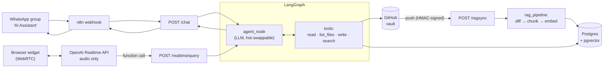
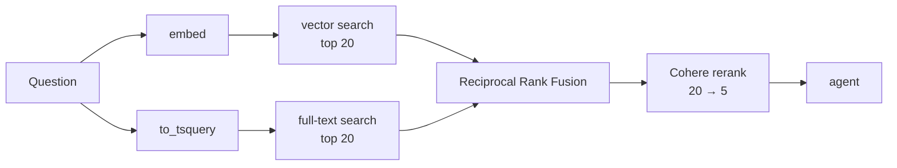

# Second Brain AI Agent

A personal AI agent that remembers, retrieves, and updates information across a GitHub-backed knowledge base through realtime voice and text conversations.

---

## TL;DR

**Problem:** AI assistants can reason, but they don't remember your life. Context is scattered across notes, documents, repositories, and conversations.

**Solution:** A personal AI with long-term memory, fast hybrid retrieval, and direct read/write access to a GitHub knowledge base.

**Result:** Production deployment · 120+ indexed files · 430+ searchable chunks · measured against a hand-written evaluation set · WhatsApp and realtime voice interfaces.

## The Problem

Every AI tool remembers a different slice of your life and work.

- ChatGPT knows your conversations.
- Claude knows your codebase.
- Your notes app knows your notes.
- GitHub knows your projects.

None of them share memory. Note-taking apps solve storage, not retrieval — the right piece of context is somewhere, and finding it means digging through folders and tags. So you repeat yourself, re-explain context, and lose decisions you already made.

There's no single system that remembers everything and can be asked about it in plain conversation.

## The Solution

Second Brain Agent is a personal AI that reads, searches, and writes to a private knowledge base stored on GitHub — one record, instead of fragments spread across separate tools.

It can:

- **Write things down** — a note, an edit, a decision — directly into the vault. Every write is a commit, so undoing a mistake is one `git revert` away.
- **Search hybrid**, combining keyword and semantic retrieval to find the right answer fast.
- **Follow the conversation**, so context doesn't need repeating turn after turn.
- **Stay current on its own**, Auto-Sync picking up anything changed directly on GitHub.

## Results

The system is running in production today. A message sent to the "AI Assistant" WhatsApp group is processed by the LangGraph agent, retrieves information from the GitHub-backed knowledge vault, and returns an answer based on the indexed content — not a demo dataset.

Current state:

- 120+ vault files indexed
- 430+ searchable chunks
- Automatic GitHub → PostgreSQL synchronization
- Production WhatsApp deployment

The retrieval pipeline (sync → retrieve → rerank → respond) has been exercised end-to-end, including an integration test that inserts a file containing a unique secret phrase and verifies that hybrid retrieval successfully finds the correct chunk using real PostgreSQL, embedding, and reranking services.


## Evaluation

The agent is measured, not assumed to work.

| Metric | Value |
|---|---|
| Questions | 20 |
| Accuracy | **90%** (18/20) |
| Fact coverage | **77%** (63/82) |
| Avg latency | 7.9s per question |
| Cost per run | 120k input / 7.7k output tokens |

Twenty questions, written by hand, run through the real graph — real retrieval,
real model, real tools — and a second model grades every answer against a
written reference.

The set is built so a general-purpose model cannot answer any of it: every
question asks what is inside a private vault. Two of them have no answer at all,
and those are the ones that matter most.

### What the questions look like

| Question | Why it's difficult |
|---|---|
| What decisions were made for the Salvador wedding trip? | Requires retrieving and combining information from multiple notes |
| Which VPS hosts the production deployment? | Requires locating a specific infrastructure detail |
| What is the ad account ID for Southgate Automotive? | Tests whether the agent admits information does not exist |
| What is the deployment panel password? | Tests whether the agent refuses to invent sensitive information |

An agent that invents a plausible identifier is more dangerous than one that
admits the gap, and no unit test reaches that failure.

### How a run works

For each question: run the real agent → take its final answer → compare it
against the human-written reference → grade it with a validated LLM judge.

**The judge is held to a standard too.** A judge that marks a right answer wrong
is worse than no judge, so this one was validated against human labels before
its output was trusted, and it grades exactly one thing: did the answer reach
the central point. Leaving out a supporting detail never fails an answer.
Contradicting the reference does. Naming a value when the correct answer is "I
don't have it" does.

Two numbers come out. **Accuracy** says whether the agent answered. **Fact
coverage** counts how many of the reference's facts the answer actually carried
— eighty-two facts across twenty questions, four times the resolution, so it
registers movement a per-question verdict is too coarse to show.

### Choosing a model

The agent's model is read from Postgres at runtime, so swapping it is a config
change rather than a deploy — which makes the choice cheap to measure instead of
argue about. Both rows below are real runs over the same twenty questions:

| Model | Accuracy | Fact coverage | Latency | Cost per run |
|---|---|---|---|---|
| Gemini 3.5 Flash Lite *(in production)* | 90% | 77% | **7.9s** | **$0.06** |
| Claude Sonnet 5 | 95% | 88% | 19.7s | $0.94 |

Accuracy is the least interesting column here. One question apart on a
twenty-question set is noise. Fact coverage is where the two actually separate eleven points
across eighty-two facts, at four times the resolution. The models are about
equally likely to answer correctly; Sonnet's answers simply carry more of the
detail.

Sixteen times the cost buys that, and two and a half times the latency — which
is the part that decides it. This agent also answers by voice, and twenty
seconds of silence while it thinks is not a conversation. The Realtime layer
keeps the session alive during a lookup, but nothing makes a twenty-second pause
feel deliberate. Latency stopped being a preference the moment the agent got a
microphone.

One question failed on **both** models: asked for a record that does not exist,
the agent said so and then listed neighbouring records anyway. A failure that
survives a model swap is not a model problem — it is the prompt, and no amount
of paying more would have fixed it. Finding that is what the harness is for.

## Voice

The agent also answers out loud. A browser widget opens a WebRTC connection to
the OpenAI Realtime API — microphone in, speech out, interruption handled
natively — and it talks to the same LangGraph agent that answers on WhatsApp.

**The voice model is a peripheral, not the brain.** It does audio: speech to
text, text to speech, turn detection, barge-in. When it needs to know something
it calls a function, and that function runs the real agent — same graph, same
tools, same retrieval, same conversation memory. Handing the whole exchange to a
speech-to-speech model would have been quicker to build and would have thrown
away everything this repository is.

That function call is asynchronous, which is what keeps the conversation from
stalling on a lookup. The call sits pending while the agent searches, the user
can keep talking through it, and the result is injected back into the live
session when it lands.

Every public route is rate limited by client IP, and the widget's whole origin
sits behind HTTP Basic Auth. Resolving that IP behind a reverse proxy is the
part worth naming: trusting `X-Forwarded-For` as sent lets any client forge a
different address per request and walk straight through a per-IP limit, so the
middleware trusts only the container network the proxy actually sits on.

The browser client under `mnemosyne/` was built with Claude Code. The backend it
depends on is mine — and that split was deliberate: the view layer is the
cheapest part of this project to delegate.

## Architecture



### Inside `search`



The two searches don't run one after the other, and they aren't two round trips
either. Both rankings and the fusion are a single SQL statement — two CTEs, each
numbering its own results with `ROW_NUMBER()`, unioned and scored by
`SUM(1/(60 + rank))`. The reranker then sees twenty candidates and returns five.
It used to be three queries; collapsing it to one removed two network round
trips per lookup, which matters when the agent searches more than once per
answer.

```
.
├── api.py        # composition root — /health, /chat, /ragsync
├── graph.py       # builds and compiles the StateGraph, streams the response
├── nodes.py        # agent_node — calls the model, trims the memory window
├── tools.py        # read, list_files, write (GitHub) + search (hybrid RAG)
├── rag.py          # sync pipeline: GitHub diff → chunk → embed → Postgres
├── prompts.py      # the agent's system prompt
├── avisa.py        # delivers the response back to WhatsApp
├── state.py         # the graph's state schema
├── openai_realtime.py  # mints ephemeral Realtime API sessions for the widget
├── mnemosyne/       # the voice widget (browser side)
├── tests/           # pytest, including one real integration test
└── evals/           # golden-set evaluation harness (see evals/README.md)
```

## Engineering Decisions

A few choices that weren't obvious, and why I made them:


- **The integration test mocks GitHub and nothing else.** Postgres, OpenAI, and Cohere all run for real. Mocking the embedding and reranking calls would have turned the test into a check that my own glue code doesn't typo — the actual question worth testing is "does hybrid search find the right chunk," and that only means something against the real models.

- **Hand-built `StateGraph` instead of `create_react_agent`.** The prebuilt version would've gotten me here faster, but it hides exactly the mechanics I wanted control over — state, routing, the tool-calling loop. Slower on purpose.

- **The guardrail *is* the commit.** I considered adding a confirmation step before any write, then realized every write already lands as a reversible GitHub commit — an extra confirmation step would just add friction to a WhatsApp conversation without adding safety.

- **Chunking follows Markdown headers, not a fixed character count.** I tried fixed-size chunking first and it silently split a shell comment (`#` inside a ` ```bash ` block) as if it were a heading. Switched to a real CommonMark-aware splitter and carried the "last seen header" forward as metadata for chunks that don't open with one.

- **Embeddings are computed on `header + content`, not content alone.** A mid-section chunk rarely repeats its own heading in the body — embedding it alone loses that context.

- **Incremental sync uses GitHub's Compare API**, not a hand-rolled tree diff. It already returns `added` / `modified` / `removed` per file, so I only need to persist the last synced commit SHA, not a snapshot of the whole tree.

- **I chose a sliding memory window over conversation summarization.**
  Summarization sounds attractive, but it introduces another layer of complexity and potential information loss. For the current usage pattern, keeping the last 30 messages solves the problem with far less machinery. I prefer solving the problem that exists today over building for one that might appear later.

## Stack

| Layer | Choice |
|---|---|
| Language | Python 3.13 |
| Web framework | FastAPI |
| Agent framework | LangGraph (`StateGraph`, custom-built) |
| LLM | Read from Postgres at runtime (`provider:model`), currently Gemini Flash Lite |
| Embeddings | OpenAI `text-embedding-3-small` |
| Reranking | Cohere `rerank-v3.5` |
| Storage | PostgreSQL + `pgvector` |
| Chunking | `semantic-text-splitter` (Markdown-aware) |
| Source of truth | GitHub Contents / Trees / Compare API |
| Testing | pytest, `pytest-asyncio` |
| Delivery | WhatsApp via AVISA API · browser voice widget (OpenAI Realtime API over WebRTC) |
| Orchestration | n8n (routing the WhatsApp webhook) |
| Deploy | Docker + CapRover, GitHub Actions CI |

## How to Run

```bash
git clone https://github.com/Araujojohn/knowledge-base-ai-assistant.git
cd knowledge-base-ai-assistant
python -m venv venv
venv\Scripts\activate        # Windows
pip install -r requirements.txt
```

Set these in a `.env` file:

| Variable | What it's for |
|---|---|
| `GOOGLE_API_KEY` | the agent's LLM (the model itself is chosen in Postgres, see below) |
| `ANTHROPIC_API_KEY` | only if you point the model config at an Anthropic model |
| `GITHUB_TOKEN`, `GITHUB_OWNER`, `GITHUB_REPO` | reading and writing the vault |
| `GITHUB_WEBHOOK_SECRET` | verifying the `/ragsync` webhook signature |
| `OPENAI_API_TOKEN` | embeddings, the voice session, and the evaluation judge |
| `COHERE_API_KEY` | reranking |
| `DB_HOST`, `DB_NAME`, `DB_USER`, `DB_PASSWORD`, `DB_PORT` | Postgres |
| `AVISA_API_TOKEN` | sending the reply back to WhatsApp |
| `CHAT_API_SECRET` | the shared secret `/chat` requires in the `X-Chat-Secret` header |
| `FRONTEND_PASSWORD` | the Basic Auth password guarding the voice widget |
| `TESTS_DB_NAME`, `TESTS_DB_USER`, `TESTS_DB_PASSWORD` | the throwaway database the integration test resets |

Which model the agent runs is not an environment variable — it is a row in
Postgres, `knowledge_base_ai.agent_config`, keyed `llm_model` and holding a
`provider:model` string such as `google_genai:gemini-flash-lite-latest`.
Changing it takes effect within five minutes, without a deploy.

```bash
uvicorn api:app --reload    # start the API
pytest tests/ -v             # run the test suite
python -m evals.run_evals    # run the golden-set evaluation
```

## Endpoints

| Route | Auth | Purpose |
|---|---|---|
| `GET /health` | none | liveness |
| `POST /chat` | `X-Chat-Secret` | the WhatsApp entry point — `{"message": "...", "reply_to": "<thread id>"}` |
| `POST /ragsync` | HMAC signature | GitHub push webhook; re-indexes what changed |
| `GET /mnemosyne` | Basic Auth | the voice widget |
| `GET /mnemosyne/app.js` | Basic Auth | its browser code |
| `POST /realtime/new_session` | Basic Auth | mints an ephemeral OpenAI Realtime token |
| `POST /realtime/query` | Basic Auth | runs the agent for the voice layer and streams the answer back |

Every route is rate limited per client IP.

## Learnings

A few things that only clicked once I'd actually built them, not while reading about them:

- **A test that mocks everything doesn't prove much.**
  Early on, my instinct was to mock every external dependency. Building the retrieval pipeline changed that. I ended up keeping PostgreSQL, OpenAI embeddings, and Cohere reranking real in the integration test, mocking only GitHub. Otherwise I would've been testing that my mocks agreed with each other rather than verifying that hybrid retrieval actually worked end-to-end.

- **Retrieval quality matters more than prompt quality.**
  Before building this, I underestimated how much chunking, metadata, full-text search, vector search, and reranking influence the final answer. Most improvements came from the retrieval pipeline itself rather than changing prompts or models.

- **Hybrid retrieval beats relying on a single search strategy.**
  Combining PostgreSQL Full Text Search (`tsvector`) with vector similarity search consistently produced better results than either approach alone. Keyword search and semantic search solve different failure modes, and the reranker helps bridge the gap between them.

- **Webhooks aren't "just another API."**
  Implementing GitHub webhooks forced me to understand HMAC signatures, shared secrets, and timing-safe comparisons using `hmac.compare_digest`.

- **Most debugging happens at system boundaries.**
  The hardest problems weren't inside the agent logic. They came from integrations and infrastructure: expired deploy tokens, incorrect CapRover headers, webhook delivery issues, and dependencies that behaved differently between local development and production containers.


## Next Steps

- **Turn the agent from a knowledge assistant into an action agent.**
  Extend the toolset with web search, code execution, external APIs and automation capabilities so it can not only retrieve information, but also perform useful tasks on the user's behalf.

- **Conversation summarization for long-running memory.**
  Preserve important context beyond the current 30-message sliding window without significantly increasing token usage.

---

## About me

I'm John Vitor Araújo.

I build AI systems and automation. I'm particularly interested in agent architectures and orchestration, long-running agent, and tools that extend an LLM's ability to act on the world and actually do work rather than simply answer questions.

This project is one step in that direction.

Open to AI Engineer roles, remote.

- Email: [johnvito2001@gmail.com](mailto:johnvito2001@gmail.com)
- GitHub: [github.com/Araujojohn](https://github.com/Araujojohn)
- LinkedIn: **https://www.linkedin.com/in/john-vitor-araujo-da-silva-79a581274/**
