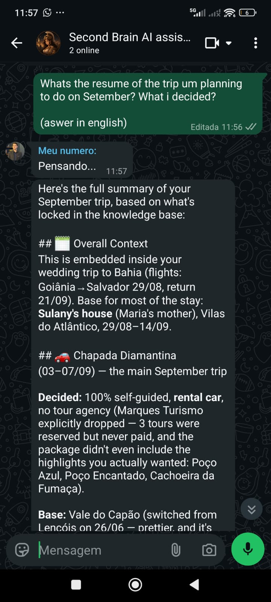
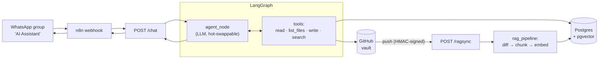

# Second Brain AI Agent

A personal AI with long-term memory, hybrid retrieval, and direct read/write access to a GitHub knowledge base.
---

## TL;DR

**Problem:** AI assistants can reason, but they don't remember your life. Context is scattered across notes, documents, repositories, and conversations.

**Solution:** A personal AI with long-term memory, fast hybrid retrieval, and direct read/write access to a GitHub knowledge base.

**Result:** Production deployment · 120+ indexed files · 430+ searchable chunks · automatic GitHub sync · WhatsApp interface.

## The Problem

Every AI tool remembers a different slice of your life and work.

- ChatGPT knows your conversations.
- Claude knows your codebase.
- Your notes app knows your notes.
- GitHub knows your projects.

None of them share memory or a coherent understanding of you.

Human memory doesn't scale either. Projects, decisions, ideas, meeting notes, lessons learned, future plans — keeping all of it in your head produces cognitive load. Note-taking apps help with storage, but retrieval stays slow: the right piece of context is often somewhere, and finding it means digging through folders, tags, or old documents.

As a result, you keep:

- Repeating yourself
- Searching through apps
- Re-explaining context
- Losing decisions and information
- Carrying mental load that shouldn't be yours to carry

There's no single system that both remembers everything and can be asked about it in plain conversation.

## The Solution

Second Brain Agent is a personal AI that reads, searches, and writes to a private knowledge base stored on GitHub — one record, instead of fragments spread across separate tools.

It can:

- **Write things down** — a note, an edit, a decision — directly into the vault. Every write is a commit, so undoing a mistake is one `git revert` away.
- **Search hybrid**, combining keyword and semantic retrieval to find the right answer fast.
- **Follow the conversation**, so context doesn't need repeating turn after turn.
- **Stay current on its own**, Auto-Sync picking up anything changed directly on GitHub.

## Results

The system is running in production today. A message sent to the "AI Assistant" WhatsApp group is processed by the LangGraph agent, retrieves information from the GitHub-backed knowledge vault, and returns an answer based on the indexed content — not a demo dataset.

Current state:

- 120+ vault files indexed
- 430+ searchable chunks
- Automatic GitHub → PostgreSQL synchronization
- Production WhatsApp deployment

The retrieval pipeline (sync → retrieve → rerank → respond) has been exercised end-to-end, including an integration test that inserts a file containing a unique secret phrase and verifies that hybrid retrieval successfully finds the correct chunk using real PostgreSQL, embedding, and reranking services.



## Evaluation

Answer quality is measured, not assumed. Twenty hand-written questions run
through the real graph — real retrieval, real model, real tools — and an LLM
judge grades each answer against a written reference. The most recent run scored
11/20 at roughly 8 seconds per question.

The questions are deliberately ones a general-purpose model cannot answer on
its own: they ask about the contents of a private vault. The two most valuable
ones have no answer at all — a secret the vault is designed never to store, and
a client with no file. Both are correct only when the agent says it doesn't have
them, which is the failure mode that matters most and the one a unit test can't
reach.

The harness and the judge's rubric are documented in
[`evals/README.md`](evals/README.md).


## Architecture



```
.
├── api.py        # composition root — /health, /chat, /ragsync
├── graph.py       # builds and compiles the StateGraph, streams the response
├── nodes.py        # agent_node — calls the model, trims the memory window
├── tools.py        # read, list_files, write (GitHub) + search (hybrid RAG)
├── rag.py          # sync pipeline: GitHub diff → chunk → embed → Postgres
├── prompts.py      # the agent's system prompt
├── avisa.py        # delivers the response back to WhatsApp
├── state.py         # the graph's state schema
├── tests/           # pytest, including one real integration test
└── evals/           # golden-set evaluation harness (see evals/README.md)
```

## Engineering Decisions

A few choices that weren't obvious, and why I made them:


- **The integration test mocks GitHub and nothing else.** Postgres, OpenAI, and Cohere all run for real. Mocking the embedding and reranking calls would have turned the test into a check that my own glue code doesn't typo — the actual question worth testing is "does hybrid search find the right chunk," and that only means something against the real models.

- **Hand-built `StateGraph` instead of `create_react_agent`.** The prebuilt version would've gotten me here faster, but it hides exactly the mechanics I wanted control over — state, routing, the tool-calling loop. Slower on purpose.

- **The guardrail *is* the commit.** I considered adding a confirmation step before any write, then realized every write already lands as a reversible GitHub commit — an extra confirmation step would just add friction to a WhatsApp conversation without adding safety.

- **Chunking follows Markdown headers, not a fixed character count.** I tried fixed-size chunking first and it silently split a shell comment (`#` inside a ` ```bash ` block) as if it were a heading. Switched to a real CommonMark-aware splitter and carried the "last seen header" forward as metadata for chunks that don't open with one.

- **Embeddings are computed on `header + content`, not content alone.** A mid-section chunk rarely repeats its own heading in the body — embedding it alone loses that context.

- **Incremental sync uses GitHub's Compare API**, not a hand-rolled tree diff. It already returns `added` / `modified` / `removed` per file, so I only need to persist the last synced commit SHA, not a snapshot of the whole tree.

- **I chose a sliding memory window over conversation summarization.**
  Summarization sounds attractive, but it introduces another layer of complexity and potential information loss. For the current usage pattern, keeping the last 30 messages solves the problem with far less machinery. I prefer solving the problem that exists today over building for one that might appear later.

## Stack

| Layer | Choice |
|---|---|
| Language | Python 3.13 |
| Web framework | FastAPI |
| Agent framework | LangGraph (`StateGraph`, custom-built) |
| LLM | Read from Postgres at runtime (`provider:model`), currently Gemini Flash Lite |
| Embeddings | OpenAI `text-embedding-3-small` |
| Reranking | Cohere `rerank-v3.5` |
| Storage | PostgreSQL + `pgvector` |
| Chunking | `semantic-text-splitter` (Markdown-aware) |
| Source of truth | GitHub Contents / Trees / Compare API |
| Testing | pytest, `pytest-asyncio` |
| Delivery | WhatsApp via AVISA API |
| Orchestration | n8n (routing the WhatsApp webhook) |
| Deploy | Docker + CapRover, GitHub Actions CI |

## How to Run

```bash
git clone https://github.com/Araujojohn/knowledge-base-ai-assistant.git
cd knowledge-base-ai-assistant
python -m venv venv
venv\Scripts\activate        # Windows
pip install -r requirements.txt
```

Set these in a `.env` file:

| Variable | What it's for |
|---|---|
| `ANTHROPIC_API_KEY` | the agent's LLM |
| `GITHUB_TOKEN`, `GITHUB_OWNER`, `GITHUB_REPO` | reading/writing the vault |
| `GITHUB_WEBHOOK_SECRET` | verifying the `/ragsync` webhook signature |
| `OPENAI_API_TOKEN` | embeddings |
| `COHERE_API_KEY` | reranking |
| `DB_HOST`, `DB_NAME`, `DB_USER`, `DB_PASSWORD`, `DB_PORT` | Postgres |
| `AVISA_API_TOKEN` | sending the reply back to WhatsApp |

```bash
uvicorn api:app --reload    # start the API
pytest tests/ -v             # run the test suite
python -m evals.run_evals    # run the golden-set evaluation
```

`POST /chat` expects `{"message": "...", "reply_to": "<whatsapp thread id>"}`. `GET /health` is a plain liveness check.

## Learnings

A few things that only clicked once I'd actually built them, not while reading about them:

- **A test that mocks everything doesn't prove much.**
  Early on, my instinct was to mock every external dependency. Building the retrieval pipeline changed that. I ended up keeping PostgreSQL, OpenAI embeddings, and Cohere reranking real in the integration test, mocking only GitHub. Otherwise I would've been testing that my mocks agreed with each other rather than verifying that hybrid retrieval actually worked end-to-end.

- **Retrieval quality matters more than prompt quality.**
  Before building this, I underestimated how much chunking, metadata, full-text search, vector search, and reranking influence the final answer. Most improvements came from the retrieval pipeline itself rather than changing prompts or models.

- **Hybrid retrieval beats relying on a single search strategy.**
  Combining PostgreSQL Full Text Search (`tsvector`) with vector similarity search consistently produced better results than either approach alone. Keyword search and semantic search solve different failure modes, and the reranker helps bridge the gap between them.

- **Webhooks aren't "just another API."**
  Implementing GitHub webhooks forced me to understand HMAC signatures, shared secrets, and timing-safe comparisons using `hmac.compare_digest`.

- **Most debugging happens at system boundaries.**
  The hardest problems weren't inside the agent logic. They came from integrations and infrastructure: expired deploy tokens, incorrect CapRover headers, webhook delivery issues, and dependencies that behaved differently between local development and production containers.


## Next Steps

- **Turn the agent from a knowledge assistant into an action agent.**
  Extend the toolset with web search, code execution, external APIs and automation capabilities so it can not only retrieve information, but also perform useful tasks on the user's behalf.

- **Conversation summarization for long-running memory.**
  Preserve important context beyond the current 30-message sliding window without significantly increasing token usage.

---

## About me

I'm John Vitor Araújo.

I build AI systems and automation. I'm particularly interested in agent architectures and orchestration, long-running agent, and tools that extend an LLM's ability to act on the world and actually do work rather than simply answer questions.

This project is one step in that direction.

Open to AI Engineer roles, remote.

- Email: [johnvito2001@gmail.com](mailto:johnvito2001@gmail.com)
- GitHub: [github.com/Araujojohn](https://github.com/Araujojohn)
- LinkedIn: **https://www.linkedin.com/in/john-vitor-araujo-da-silva-79a581274/**
